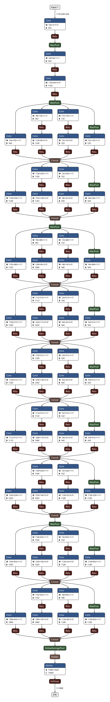

# GoogleNet
**[4]** GoogleNet
Christian Szegedy(Google Inc), et al. 2014
[Paper](https://www.cv-foundation.org/openaccess/content_cvpr_2015/papers/Szegedy_Going_Deeper_With_2015_CVPR_paper.pdf)

## Notes

- Inception module
- Network-in-Network : 1x1 convolutions
- 1x1 conv's (ref as *bottle-neck*) before 3x3 & 5x5 filters[shown as "#3x3" and ""#5x5 reduce] --> dimensionality reduction
- ratio of 3x3 and 5x5 layers increase in higher layers.
- ensemble prediction done over multiple models
- Approximate expected optimal sparse structures using dense blocks.

## Architecture 

