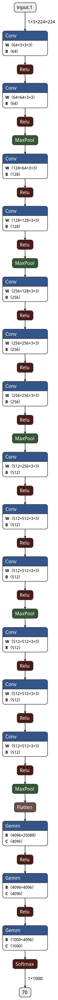

# VGG Net
**[3]** VGG Net
Karen Simonyan and Andrew Zisserman (Visual Geomteric Group @ University of Oxford). "Very Deep Convolutional Netwroks for Large-Scale Image Recognition". 2014
[Paper](https://arxiv.org/pdf/1409.1556.pdf)

## Notes

### Part A
- kernel size of 3x3 throughout.
- stride = 1; padding = 1
- max pool : 2,2; not all layers have pool.
- ReLu used.
- stack conv layers, for instance stack 3x3 conv layers rather than a single 7x7 layer. why ?
three non-linear rectification layers makes decision boundary more discriminative.
- momentum = 0.9, decay = 5.10^-4, dropout = 0.5
- learning rate decay used.
- convergence improved by -
    - implicit regularization --> greater depth , smaller kernels
    - pre-initialization of ceratin layers.
- random initialisation of weights 
- multi-scale training & scale jittering  --> increases accuracy
- Fusion 
    - averaging best soft-max results of multiple models.

### Part B
- Object localisation task
- Eucledian loss -> penalizes deviation of bounding boxes.
- no scale jittering and initialisations used from classification.
- no resolution enhancement technique used.

## Architecture 

[VGG-16]
