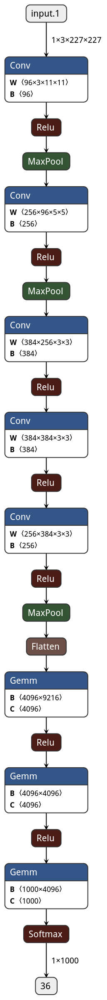

# AlexNet
**[2]** AlexNet
Alex Krizhevsky, Ilya Sutskever and Geoffrey E. Hinton. "ImageNet Classification with Deep Convolutional Neural Networks". 2012
[Paper](https://papers.nips.cc/paper/4824-imagenet-classification-with-deep-convolutional-neural-networks.pdf)

## Notes
- Intermediate layers of convolution have a pad of 1, to preserve the feature maps.
- ReLU instead of Tanh(saturated)
- Local normalization follows the first two conv layers before pooling, but this is not practised anymore.
- To reduce chances of overfitting -
    - Overlapping pooling 
    - Use of dropout
    - Data Augmentation
- SGD with momentum of 0.8 and weight decay of 0.0005.
- Computation was done in two pathways i.e spread across two GPUs. 

## Architecture 

