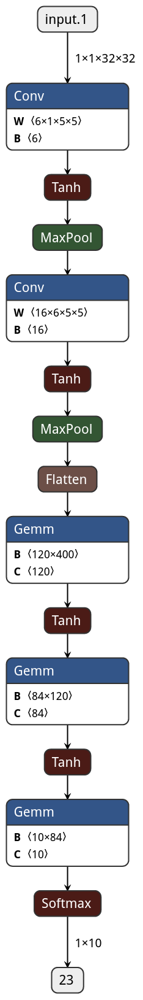

# LeNet-5
**[1]** LeNet-5
Y.LeCun, L.Bottou, Y.Bengio, and P.Haffner. "Gradient-based learning applied to document recognition". 1998
[Paper](http://yann.lecun.com/exdb/publis/pdf/lecun-01a.pdf)

## Notes
- MaxPooling layers are used which are referred as *sub-sampling layers*.
- Used Tanh as actiavtion function.
- Around 60k paramters.
- C5 is labelled as Covn layer rather than FC layer becuase of input if is made higher keeping everything else constant feature map dimension would be greater than 1x1.

## Architecture 

